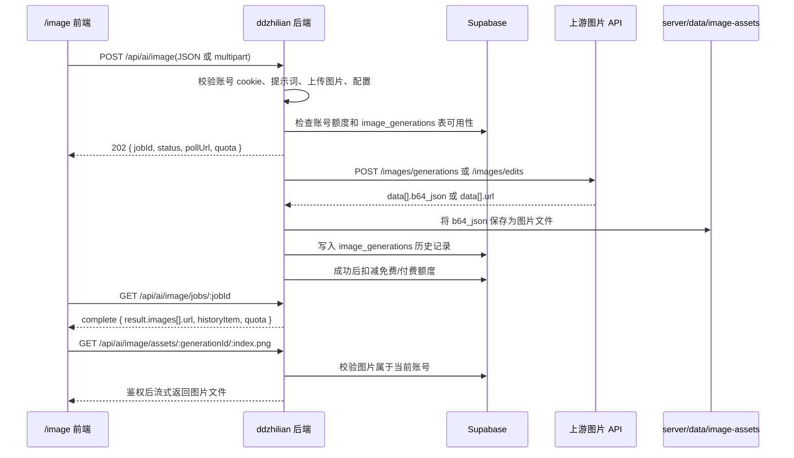

# 生图功能实现文档

本文档说明当前 `/image` 生图功能的实现方式，重点覆盖 API 接入、参考图片上传、异步返回、生成图片存储、账号鉴权、额度和历史记录。本文档只描述现有实现，不引入新的接口设计。

## 1. 功能边界

### 已覆盖

- 账号登录后才能使用生图功能。
- 文本生图：前端提交提示词，后端转发到上游 `/images/generations`。
- 上传图片修改：前端上传一张或多张参考图，后端转发到上游 `/images/edits`。
- 异步任务：创建任务后返回 `jobId`，前端轮询任务状态。
- 图片返回：上游返回的 `b64_json` 会落盘为服务端图片文件，再以鉴权图片 URL 返回前端。
- 生图历史：按账号写入 Supabase `image_generations` 表，前端按游标分页加载。
- 图片额度：按账号记录每日免费额度和付费额度，成功返回图片后才扣减。

### 不在本文档范围

- 文本 AI 聊天接口。
- 管理后台 UI 的详细实现。
- 生产服务器部署流程。
- 上游图片模型自身的计费和策略。

## 2. 代码入口

| 职责 | 文件 |
| --- | --- |
| `/image` 登录门禁 | `src/app/components/ImageAccountGate.tsx` |
| `/image` 生图界面、上传预览、历史加载 | `src/app/components/ImageGenerationStage.tsx` |
| 前端 API 调用封装 | `src/lib/use-ddzhilian.ts` |
| 前端账号会话封装 | `src/lib/use-account-auth.ts` |
| 后端 HTTP 路由、上游转发、任务轮询、图片落盘 | `server/src/index.ts` |
| 后端环境变量解析 | `server/src/config.ts` |
| 账号、会话、额度读写 | `server/src/registry/account-registry.ts` |
| 生图历史 Supabase 持久化 | `server/src/registry/image-generation-history-registry.ts` |
| Supabase 表结构 | `supabase/schema.sql`、`supabase/migrations/*` |
| 后端环境变量模板 | `server/.env.example` |

## 3. 总体流程



## 4. 必要配置

### Supabase 配置

生图功能依赖 Supabase Auth、账号资料和生图历史表。后端只有在同时配置 `SUPABASE_URL` 与 `SUPABASE_SERVICE_ROLE_KEY` 时才会启用账号和生图历史能力。

```env
SUPABASE_URL=
SUPABASE_SERVICE_ROLE_KEY=
SUPABASE_USER_PROFILES_TABLE=user_profiles
SUPABASE_IMAGE_GENERATIONS_TABLE=image_generations
```

启用前需要执行 `supabase/schema.sql` 或对应迁移：

- `20260429133000_account_image_history.sql`：创建 `user_profiles` 与 `image_generations`。
- `20260430152000_user_image_quota.sql`：补充每日免费额度字段。
- `20260430165000_user_image_paid_quota.sql`：补充付费额度字段。
- `20260514152000_image_quota_reservations.sql`：创建 `image_quota_reservations` 和数据库级额度预占 / 确认 / 释放函数。

### 上游图片 API 配置

后端通过 OpenAI 图片接口兼容形态接入上游反代。密钥只放在后端环境变量中，前端不接触上游密钥。

```env
CODEX_IMAGE_BASE_URL=https://cpa.shiro1888.com/v1
CODEX_IMAGE_API_KEY=
CODEX_IMAGE_MODEL=gpt-image-2
CODEX_IMAGE_SIZE=auto
CODEX_IMAGE_QUALITY=auto
CODEX_IMAGE_MAX_PROMPT_CHARS=4000
CODEX_IMAGE_PARALLEL_REQUESTS=2
CODEX_IMAGE_DAILY_FREE_QUOTA=3
CODEX_IMAGE_QUOTA_RESET_HOUR=4
CODEX_IMAGE_QUOTA_TIMEZONE_OFFSET_MINUTES=480
```

`CODEX_IMAGE_BASE_URL` 可以填写基础地址，也可以误填到 `/images/generations` 或 `/images/edits`；`server/src/config.ts` 会归一化为基础地址。实际请求路径由后端根据请求类型拼接：

- 文本生图：`{CODEX_IMAGE_BASE_URL}/images/generations`
- 上传图片修改：`{CODEX_IMAGE_BASE_URL}/images/edits`

## 5. 前端如何发起请求

前端统一通过 `src/lib/use-ddzhilian.ts` 中的 `generateImage(...)` 调用后端。

### 文本生图

没有参考图时，前端发送 JSON：

```http
POST /api/ai/image
Content-Type: application/json
Cookie: ddzhilian_user_session=...
```

```json
{
  "prompt": "一张适合网站首页的科技感插图",
  "model": "gpt-image-2",
  "size": "auto",
  "quality": "auto"
}
```

### 上传图片修改

选择参考图片时，前端发送 `multipart/form-data`，图片字段名为 `image[]`：

```http
POST /api/ai/image
Content-Type: multipart/form-data; boundary=...
Cookie: ddzhilian_user_session=...
```

字段：

| 字段 | 必填 | 说明 |
| --- | --- | --- |
| `prompt` | 是 | 图片生成或修改提示词 |
| `model` | 否 | 不传则使用 `CODEX_IMAGE_MODEL` |
| `size` | 否 | 不传则使用 `CODEX_IMAGE_SIZE`；`/image` 前端按所选比例把分辨率解释为最长边 1080 / 1440 / 2000；显式 `WIDTHxHEIGHT` 会在后端归一到最接近的 16 倍数后再转发上游 |
| `quality` | 否 | 不传则使用 `CODEX_IMAGE_QUALITY` |
| `image[]` | 否 | 参考图文件；存在时走图片编辑接口 |

后端限制：

- 最多 8 张参考图。
- 单张图片最大 8 MiB。
- 只允许 `image/png`、`image/jpeg`、`image/webp`。
- multipart 请求体最大 32 MiB。
- JSON 请求体最大 16 KiB。
- 提示词最大字符数默认 4000，可由 `CODEX_IMAGE_MAX_PROMPT_CHARS` 配置。

## 6. 后端如何接上游 API

后端接收到 `/api/ai/image` 后，按以下顺序处理：

1. 校验当前请求是否带有有效账号 cookie。
2. 检查 Supabase 生图历史是否配置。
3. 检查上游图片 API 配置是否有效。
4. 读取 JSON 或 multipart 请求体。
5. 校验提示词、上传图片数量、图片类型和图片大小。
6. 检查当前账号剩余额度。
7. 创建内存中的异步任务并返回 `202`。
8. 后台任务调用上游图片 API。
9. 成功后保存图片、写历史、扣额度。

文本生图上游请求体：

```json
{
  "model": "gpt-image-2",
  "prompt": "提示词",
  "size": "auto"
}
```

如果 `quality` 不是 `auto`，后端才会把 `quality` 传给上游。

图片编辑上游请求体使用 `FormData`：

```text
model=gpt-image-2
prompt=提示词
size=auto
quality=high
image[]=...
```

后端会携带：

```http
Authorization: Bearer ${CODEX_IMAGE_API_KEY}
```

如果没有配置 `CODEX_IMAGE_API_KEY`，后端仍会请求上游，但不会带 `Authorization`。是否可用取决于上游反代配置。

## 7. 异步任务与轮询

`POST /api/ai/image` 不直接等待上游生成完成，而是创建任务后返回：

```json
{
  "jobId": "uuid",
  "status": "queued",
  "sourceImageCount": 0,
  "createdAt": "2026-05-03T00:00:00.000Z",
  "updatedAt": "2026-05-03T00:00:00.000Z",
  "quota": {
    "freeRemaining": 3,
    "paidRemaining": 0,
    "totalRemaining": 3
  },
  "pollUrl": "/api/ai/image/jobs/uuid"
}
```

前端随后轮询：

```http
GET /api/ai/image/jobs/:jobId
Cookie: ddzhilian_user_session=...
```

前端允许在已有任务生成中继续提交下一条提示词；每次提交都会创建一个独立任务并独立轮询。后端在创建新任务前通过 Supabase `reserve_image_quota(...)` 写入 `image_quota_reservations`，在数据库事务内锁定当前账号的 `user_profiles` 行并预占额度。这样即使后端将来变成多进程或多实例，也会共享同一份数据库预占状态，避免等待期间超过账号剩余额度继续启动上游请求。单个任务会按 `CODEX_IMAGE_PARALLEL_REQUESTS` 同时发起上游请求，默认 2 路并发，先成功的结果会被采用，其余本地请求会被中止；该策略能缩短 524 超时链路，但会增加上游请求压力。

任务完成时返回：

```json
{
  "jobId": "uuid",
  "status": "complete",
  "result": {
    "provider": "codex-reverse-proxy",
    "model": "gpt-image-2",
    "images": [
      {
        "url": "https://ddzhilian.com/api/ai/image/assets/uuid/0.png",
        "mimeType": "image/png",
        "revisedPrompt": "...",
        "byteSize": 1048576,
        "width": 1024,
        "height": 1024
      }
    ],
    "createdAt": "2026-05-03T00:00:30.000Z",
    "historyItem": {
      "generationId": "uuid",
      "prompt": "提示词",
      "provider": "codex-reverse-proxy",
      "model": "gpt-image-2",
      "size": "auto",
      "quality": "auto",
      "images": [
        {
          "url": "https://ddzhilian.com/api/ai/image/assets/uuid/0.png",
          "mimeType": "image/png",
          "byteSize": 1048576,
          "width": 1024,
          "height": 1024
        }
      ],
      "createdAt": "2026-05-03T00:00:30.000Z"
    },
    "quota": {
      "freeRemaining": 2,
      "paidRemaining": 0,
      "totalRemaining": 2
    }
  }
}
```

任务只保存在当前后端进程内，默认最多保留 30 分钟，最多 200 个任务。任务过期或服务重启后，前端不能继续轮询旧任务，但已经成功写入 Supabase 的结果仍可通过历史接口加载。

## 8. 图片如何保存和返回

上游可能返回两类图片数据：

- `data[].b64_json`
- `data[].url`

当前后端对 `b64_json` 的处理是：

1. 解码 base64。
2. 读取文件字节数，并从 PNG/JPEG/WebP 文件头解析实际像素宽高。
3. 根据 MIME 类型生成扩展名，默认 `png`。
4. 保存到 `server/data/image-assets/<userId>/<generationId>/<index>.<ext>`。
5. 将返回给前端的图片地址改为 `/api/ai/image/assets/:generationId/:index.png`。
6. 写入 Supabase 历史时保存 URL、MIME 类型、revised prompt、文件字节数和像素宽高，不把 base64 作为前端响应长期返回。

图片文件访问接口：

```http
GET /api/ai/image/assets/:generationId/:index.png
Cookie: ddzhilian_user_session=...
```

安全检查：

- 必须登录。
- 后端先从 `image_generations` 查询当前账号自己的 `generationId`。
- 只有历史记录属于当前账号，且图片 URL 与请求路径匹配时，才读取磁盘文件。
- 响应头包含 `Content-Type`、`Content-Disposition: inline`、`Cache-Control: private` 和 `X-Content-Type-Options: nosniff`。

如果上游直接返回外部 `url`，后端会保留该 URL；只有 `b64_json` 会被落盘成本站鉴权图片 URL。外部 URL 不会被额外下载探测，因此 `byteSize`、`width`、`height` 可能为空。

## 9. 生图历史

历史表：`public.image_generations`

| 字段 | 说明 |
| --- | --- |
| `generation_id` | 生图任务 ID，主键 |
| `user_id` | Supabase Auth 用户 ID |
| `prompt` | 原始提示词 |
| `provider` | 当前固定为 `codex-reverse-proxy` |
| `model` | 实际使用模型 |
| `size` | 实际使用尺寸 |
| `quality` | 实际使用质量 |
| `images` | JSON 数组，保存图片 URL、MIME 类型、revised prompt、可用时的 `byteSize`、`width`、`height` |
| `created_at` | 生成完成时间 |

分页接口：

```http
GET /api/ai/image/history?limit=12
GET /api/ai/image/history?limit=12&beforeCreatedAt=...&beforeGenerationId=...
```

返回：

```json
{
  "items": [],
  "hasMore": true,
  "nextCursor": {
    "createdAt": "2026-05-03T00:00:00.000Z",
    "generationId": "uuid"
  },
  "quota": {}
}
```

排序规则是 `created_at desc, generation_id desc`。游标同时使用 `createdAt` 和 `generationId`，避免同一时间生成多条记录时分页重复或漏项。

## 10. 图片额度

额度表：`public.user_profiles`

| 字段 | 说明 |
| --- | --- |
| `image_quota_period_started_at` | 当前免费额度周期开始时间 |
| `image_quota_used` | 当前周期已用免费额度 |
| `image_paid_quota_remaining` | 付费剩余额度 |
| `image_paid_quota_used` | 付费已用额度 |

额度预占表：`public.image_quota_reservations`

| 字段 | 说明 |
| --- | --- |
| `reservation_id` | 生图任务 ID，主键 |
| `user_id` | Supabase Auth 用户 ID |
| `period_started_at` | 本次预占对应的免费额度周期 |
| `free_count` | 本次预占的免费额度张数 |
| `paid_count` | 本次预占的付费额度张数 |
| `status` | `active`、`confirmed`、`released` 或 `expired` |
| `expires_at` | 后端异常退出后的预占过期时间 |

额度接口：

```http
GET /api/ai/image/quota
Cookie: ddzhilian_user_session=...
```

返回字段包括：

- `freeLimit`
- `freeUsed`
- `freeReserved`
- `freeRemaining`
- `paidRemaining`
- `paidUsed`
- `paidReserved`
- `totalReserved`
- `totalRemaining`
- `periodStartedAt`
- `resetAt`
- `resetHour`
- `timezoneOffsetMinutes`

扣减规则：

1. 创建任务前先调用数据库函数预占 1 张额度。
2. 后台任务真正拿到图片并保存历史后，调用数据库函数确认预占并扣减额度。
3. 任务失败、上游失败、图片保存失败或历史保存失败时，释放该任务的预占额度。
4. 优先预占和消耗每日免费额度。
5. 免费额度不足时，再预占和消耗付费额度。
6. 默认每日 04:00 刷新免费额度，时区偏移默认 `480` 分钟。

## 11. 错误处理和重试

常见错误：

| 场景 | HTTP 状态 | 返回信息 |
| --- | --- | --- |
| 未登录 | 401 | `请先登录账号后再使用生图功能。` |
| 会话失效 | 401 | `账号会话已失效，请重新登录。` |
| 未配置 Supabase | 503 | `生图历史未配置，请先配置 Supabase。` |
| Supabase 表不可用 | 503 | `生图历史数据库不可用，请先执行 Supabase 迁移。` |
| 提示词为空 | 400 | `Missing image prompt.` |
| 上传图片过多 | 413 | `最多一次上传 8 张图片。` |
| 图片类型不支持 | 415 | `只支持 PNG、JPEG 或 WebP 图片。` |
| 单图超过 8 MiB | 413 | `单张图片不能超过 8 MiB。` |
| 总额度不足 | 429 | `总额度已耗尽。` |
| 上游超时 | 504/524 映射 | `图片反代请求超时，上游服务没有及时返回结果，请稍后重试。` |
| 上游鉴权失败 | 401/403 映射 | `图片反代鉴权失败，请检查 CODEX_IMAGE_API_KEY 配置。` |

上游请求重试策略：

- 只对 `502`、`504`、`524` 重试。
- 最多 3 次。
- 重试间隔为 `3000ms * attempt`。
- 日志会记录 `baseUrl`、接口类型、状态码、模型、尝试次数和耗时。

## 12. 最小接入清单

1. 执行 Supabase schema 或迁移，确保 `user_profiles`、`image_generations` 字段完整。
2. 在 `server/.env` 配置 `SUPABASE_URL` 与 `SUPABASE_SERVICE_ROLE_KEY`。
3. 配置 `CODEX_IMAGE_BASE_URL`、`CODEX_IMAGE_API_KEY`、`CODEX_IMAGE_MODEL`。
4. 确认 `server/data/image-assets` 所在磁盘可写。
5. 启动后端，访问 `/api/auth/session` 确认账号能力已配置。
6. 登录账号后访问 `/image`。
7. 用纯文本提示词测试 `/images/generations` 分支。
8. 上传一张 PNG/JPEG/WebP 测试 `/images/edits` 分支。
9. 确认 `GET /api/ai/image/history` 能返回历史。
10. 确认图片 URL 必须登录后才能访问。

## 13. 维护注意事项

- 不要把上游 API key 放进前端代码。
- 不要把生成图片 base64 长期返回给浏览器；当前实现会把 base64 落盘后返回 URL。
- 如果上游直接返回外部图片 URL，该 URL 当前会原样返回，访问控制取决于上游；如需统一本站鉴权，需要增加“下载外链并落盘”的后端流程。
- 修改上传字段名时，需要同步前端 `image[]` 和后端 multipart 解析逻辑。
- 修改额度逻辑时，要保持“创建任务先预占、成功保存历史后确认扣减、失败释放预占”的闭环，否则失败请求会误占或误扣额度。
- 修改历史分页时，要保留 `createdAt + generationId` 双游标，避免同时间记录分页不稳定。
- 当前生图任务创建使用 Supabase 数据库函数做额度预占，已覆盖多后端实例并发创建任务的主要风险；如果后续接入购买、退款或批量生图，还需要把对应资金和额度变更也纳入数据库事务。
